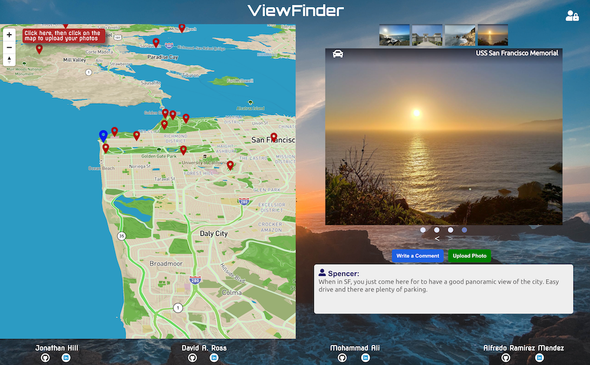
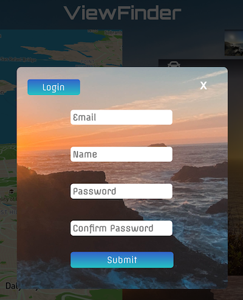
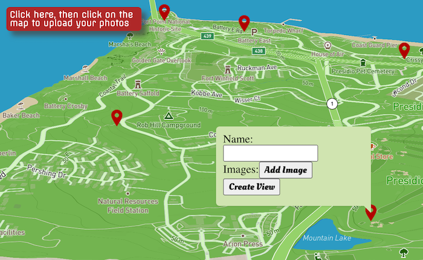
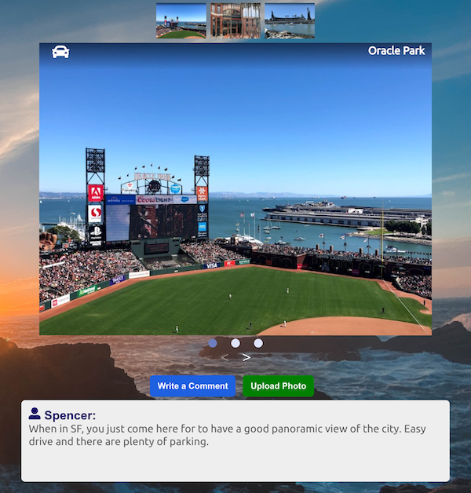
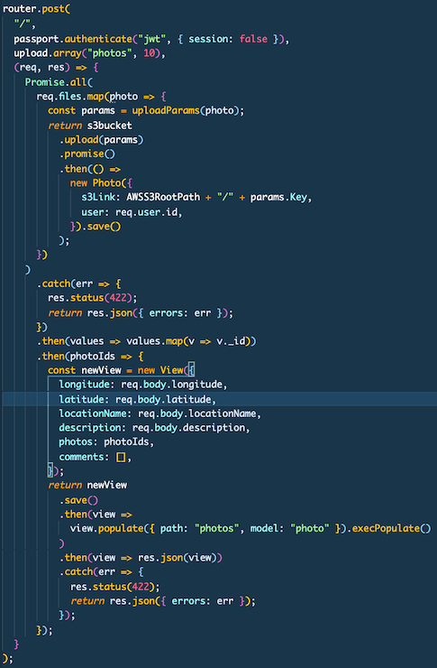

# ViewFinder
ViewFinder is an app in which users can discover curated community chosen locations where great views can be found, see snapshots of the views taken from the ViewFinder community, read contributed comments, write their own, as well as upload their own photos.  

## Technologies & Framework
* MERN Stack
* React & Redux 
* Multer
* Express.js 
* MongoDB 
* Mapbox API
* AWS S3

## Features 
* Secure user authentication using BCrypt
* Demo-login for guest users 

# Mapbox 
Logged in users have the ability to click the red upload banner and drop a pin on the map and upload multiple photos from that location.  

Driving directions to all locations are just a click away!

# View routes 

Allowing users to upload multiple files to S3 while at the same time saving the photo metadata to the database was accomplished using Multer middleware which enabled parsing of multi part form data.

## Contributing
* David Ross - Team lead
* Jonathan Hill - Backend lead 
* Alfredo Ramirez-Mendez - Frontend lead 
* Mohammad Ali Taghva - Flex lead 

